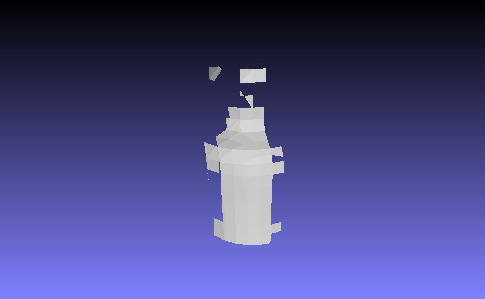
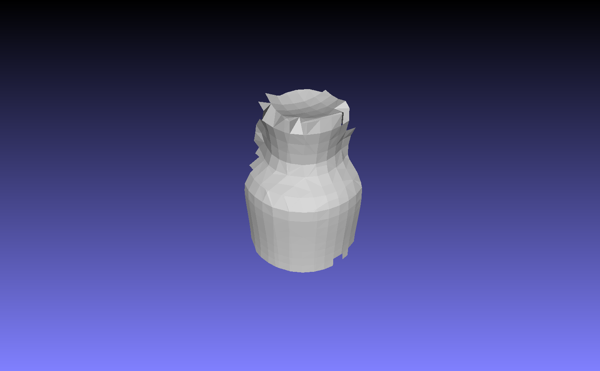
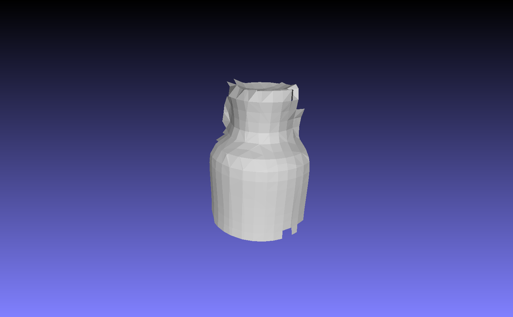

This fork excludes Kinect from the VoxelHashing pipeline and provides documentation for offline usage. Offline mode presumes that user has recorded depth (and images) data and he want to generate reconstruction from it. For this purpose two types of converters can be used. One is called BinaryDumpFileConverter and it aggregates all scans (depth and images), camera trajectory (saved in camera poses matrices) and supporting info (images resolution, etc) in a suitable for VoxelHashing format. Second converter is more suitable for a VoxelHashing extension called BundleFusion and it is called SensConverter. TODO: add info about sens data


(Managed to run with) Requirements:
- DirectX SDK June 2010
- NVIDIA CUDA 7.0 (for the CUDA implementation)
Installation Guide:
0. Install Visual Studio 2013, CUDA 7.0 and DirectX SDK June 2010. CUDA 7.5 might be also possible, then you may skip step [], I suppose. However I haven't tried this approach.
TODO: Complete Installation guide

Important parameters (with some description):

* s_adapterWidth, s_adapterHeight  -- input depth is re-sampled to this grid
* s_sensorDepthMax, s_sensorDepthMin -- allowed depth range

* s_SDFVoxelSize -- voxel size in meter
* s_SDFMarchingCubeThreshFactor -- marching cube thresh: s_SDFMarchingCubeThresh = s_SDFMarchingCubeThreshFactor*s_SDFVoxelSize, it defines which samples are inside/outside of the surface; Bigger means that more Part of the code that represents behavior:
```
// MarchingCubesSDFUtil.h
void extractIsoSurfaceAtPosition(const float3& worldPos, const HashData& hashData, const RayCastData& rayCastData){
    const float thres = params.m_threshMarchingCubes;
		float distArray[] = {dist000, dist100, dist010, dist001, dist110, dist011, dist101, dist111};
		for(uint k = 0; k < 8; k++) {
			for(uint l = 0; l < 8; l++) {
				if(distArray[k]*distArray[l] < 0.0f) {
					if(abs(distArray[k]) + abs(distArray[l]) > thres) return;
				}
				else {
					if(abs(distArray[k]-distArray[l]) > thres) return;
				}
			}
		}
    if(abs(dist000) > params.m_threshMarchingCubes2) return;
		if(abs(dist100) > params.m_threshMarchingCubes2) return;
		if(abs(dist010) > params.m_threshMarchingCubes2) return;
		if(abs(dist001) > params.m_threshMarchingCubes2) return;
		if(abs(dist110) > params.m_threshMarchingCubes2) return;
		if(abs(dist011) > params.m_threshMarchingCubes2) return;
		if(abs(dist101) > params.m_threshMarchingCubes2) return;
		if(abs(dist111) > params.m_threshMarchingCubes2) return;
    // <...>
}
```

Examples of reconstruction:
VoxelSize 1cm MC Thresh 2             |  VoxelSize 1cm MC Thresh 10             |  VoxelSize 1cm MC Thresh 20
:-------------------------:|:-------------------------:|:-------------------------:
  |    |  

* s_SDFTruncation -- truncation for SDF (defined with respect ot the depth value so the range is defined around each depth pixel), defined in meter (5.0f*s_SDFVoxelSize) & works with s_SDFTruncationScale parameter
* s_SDFTruncationScale  -- truncation scale in meter per meter (2.5f*s_SDFVoxelSize); Part of the code that represent behavior:
```

//VoxelUtilHashSDF.h
float getTruncation(float z) const {
		return c_hashParams.m_truncation + c_hashParams.m_truncScale * z;
	}
  

// <...>

// CUDASceneRepHashSDF.cu
__global__ void allocKernel(HashData hashData, DepthCameraData cameraData, const unsigned int* d_bitMask) {
    // <...>
    float t = hashData.getTruncation(d);
		float minDepth = min(hashParams.m_maxIntegrationDistance, d-t);
		float maxDepth = min(hashParams.m_maxIntegrationDistance, d+t);
		if (minDepth >= maxDepth) return;
    
    float3 rayMin = cameraData.kinectDepthToSkeleton(x, y, minDepth);
		rayMin = hashParams.m_rigidTransform * rayMin;
		float3 rayMax = cameraData.kinectDepthToSkeleton(x, y, maxDepth);
		rayMax = hashParams.m_rigidTransform * rayMax;
    
    // <...>
}

// <...>

__global__ void integrateDepthMapKernel(HashData hashData, DepthCameraData cameraData) {
  float sdf = depth - pf.z;
	float truncation = hashData.getTruncation(depth);
	if (sdf > -truncation) // && depthZeroOne >= 0.0f && depthZeroOne <= 1.0f) //check if in truncation range should already be made in depth map computation
	{
		if (sdf >= 0.0f) {
	      sdf = fminf(truncation, sdf);
		} else {
		    sdf = fmaxf(-truncation, sdf);
		}
    // <...>
  }
          
}

// CUDASceneRepHashSDF.cu
__global__ void garbageCollectIdentifyKernel(HashData hashData) {
    // <...>
    if (threadIdx.x == blockDim.x - 1) {
		float minSDF = shared_MinSDF[threadIdx.x];
		uint maxWeight = shared_MaxWeight[threadIdx.x];

		float t = hashData.getTruncation(c_depthCameraParams.m_sensorDepthWorldMax);	//MATTHIAS TODO check whether this is a reasonable metric

		if (minSDF >= t || maxWeight == 0) {
	      hashData.d_hashDecision[hashIdx] = 1;
		} else {
	      hashData.d_hashDecision[hashIdx] = 0; 
		}
	}
}
  
```
* s_SDFMaxIntegrationDistance -- range for new observations to be integrated (in meters)
* s_SDFIntegrationWeightSample --

```
__device__
	static inline float cameraToKinectProjZ(float z)	{
	    return (z - c_depthCameraParams.m_sensorDepthWorldMin)/(c_depthCameraParams.m_sensorDepthWorldMax - c_depthCameraParams.m_sensorDepthWorldMin);
	}

__global__ void integrateDepthMapKernel(HashData hashData, DepthCameraData cameraData) {
    // <...>
    float depthZeroOne = cameraData.cameraToKinectProjZ(depth);
    // <...>
    float weightUpdate = max(hashParams.m_integrationWeightSample * 1.5f * (1.0f-depthZeroOne), 1.0f);
    // <...>
}
```

* s_SDFIntegrationWeightMax -- used in CombineVoxels in VoxelUtilHashSDF.h, set as 255 by default TODO: Do we really need any upper bound for weights?

* SDF_BLOCK_SIZE -- refers to memory allocation, set up manually as global variable and equals 8 
* s_hashBucketSize -- allocates memory fo MC, set up manually as global variable and equals 10 

```
// CUDASceneRepChunkGrid.cu
__global__ void  chunkToGlobalHashPass1Kernel(HashData hashData, uint numSDFBlockDescs, uint heapCountPrev, const SDFBlockDesc* d_SDFBlockDescs, const Voxel* d_SDFBlocks)
{
	const unsigned int bucketID = blockIdx.x*blockDim.x + threadIdx.x;
	const uint linBlockSize = SDF_BLOCK_SIZE * SDF_BLOCK_SIZE * SDF_BLOCK_SIZE;

	if (bucketID < numSDFBlockDescs)	{  
		
		uint ptr = hashData.d_heap[heapCountPrev - bucketID]*linBlockSize;	//mass alloc

		HashEntry entry;
		entry.pos = d_SDFBlockDescs[bucketID].pos;
		entry.offset = 0;
		entry.ptr = ptr;

		//TODO MATTHIAS check this: if this is false, we have a memory leak... -> we need to make sure that this works! (also the next kernel will randomly fill memory)
		bool ok = hashData.insertHashEntry(entry);
	}
}

// <...>
```

* s_hashNumBuckets -- allocates memory fo MC;
* s_hashNumSDFBlocks -- in case of wrong definition throws message: "WARNING: Heap Free Count is low!  if crash, increase s_hashNumSDFBlocks"

* s_marchingCubesMaxNumTriangles -- allocates memory fo MC; in case of wrong definition throws an exception: "not enough memory to store triangles for chunk; increase s_marchingCubesMaxNumTriangles" in CUDAMarchingCubesHashSDF::copyTrianglesToCPU;


* s_SDFRayIncrementFactor = 0.8f;			//(don't touch) s_SDFRayIncrement = s_SDFRayIncrementFactor*s_SDFTrunaction;
* s_SDFRayThresSampleDistFactor = 50.5f;	//(don't touch) s_SDFRayThresSampleDist = s_SDFRayThresSampleDistFactor*s_rayIncrement;
* s_SDFRayThresDistFactor = 50.0f;		//(don't touch) s_SDFRayThresDist = s_SDFRayThresSampleDistFactor*s_rayIncrement;


==============================================================================================================================================

You are free to use this code with proper attribution in non-commercial applications (Please see License.txt).
We are also happy to allow free commercial use; however, in that case we would like you to conact us first.
For use in a publication or presentation, please cite the VoxelHashing publication(s).

INSTALLATION:
The code was developed under VS2012.

CONTACT (feel free to contact us):
niessner@cs.stanford.edu
michael.zollhoefer@cs.fau.de


